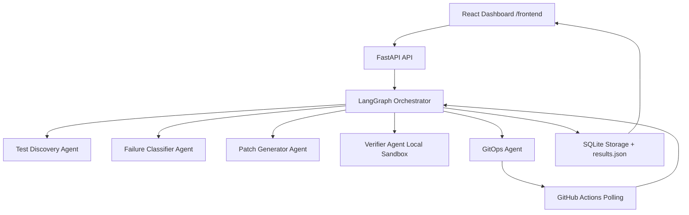

# Architecture

## Key Guarantees
- Branch format is enforced as `TEAM_NAME_LEADER_NAME_AI_Fix`.
- Commit messages are enforced with `[AI-AGENT]` prefix.
- Timeline shows every CI iteration with pass/fail and timestamps.
- `results.json` is generated at end of each run.
