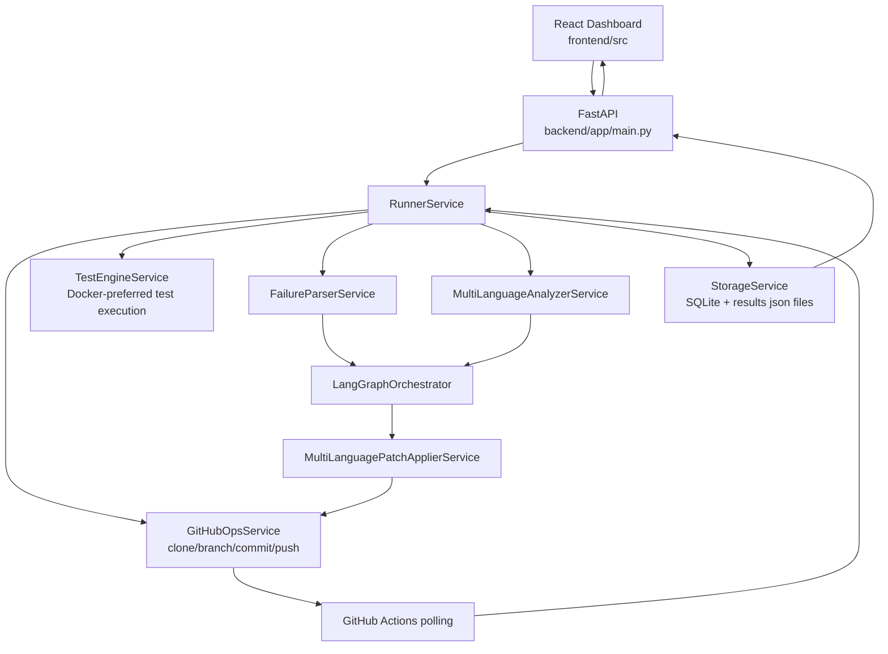

# Architecture

This document describes the current runtime architecture implemented in the repository.

## High-level flow

## Backend components

- `backend/app/main.py`
  - Exposes `POST /api/runs`, `GET /api/runs/{run_id}`, `POST /api/runs/{run_id}/resume`, `GET /health`.
- `backend/app/services/runner.py`
  - Central execution loop and retry control.
  - Merges parser and static-analysis failures.
  - Applies fixes, commits, pushes, polls CI, writes timeline.
- `backend/app/agents/langgraph_flow.py`
  - Multi-agent classify → generate → verify pipeline.
- `backend/app/services/multi_language_analyzer.py`
  - Routes static analysis to Python, Java, JavaScript, and TypeScript analyzers.
- `backend/app/services/multi_language_patch_applier.py`
  - Routes fixes to language-specific patchers.
- `backend/app/services/storage.py`
  - Persists run payload snapshots in SQLite (`backend/data/runs.db`).
  - Writes `results_<run_id>.json` and `results.json`.

## Frontend components

- `frontend/src/context/RunContext.jsx`
  - Starts runs and polls run details every 2.5 seconds until terminal status.
- `frontend/src/components/*`
  - Presents summary, score chart, fixes table, and timeline.

## Execution loop details

For each run iteration (`retry_limit` bounded):
1. Run tests (Docker sandbox when available).
2. Parse test output failures.
3. Run static analyzers across supported languages.
4. Merge and deduplicate failures.
5. Generate fix plans through LangGraph agents.
6. Apply fixes per language-specific patcher.
7. Commit + push branch updates.
8. Poll GitHub Actions for CI result.
9. Append timeline event and persist run state.

Run ends as `PASSED` or `FAILED`; score and result files are finalized at completion.

## Policy guarantees

- Branch format: `TEAM_NAME_LEADER_NAME_AI_Fix`
- Commit prefix: `[AI-AGENT]`
- No direct push to `main`
- Timeline records iteration status with UTC timestamp
